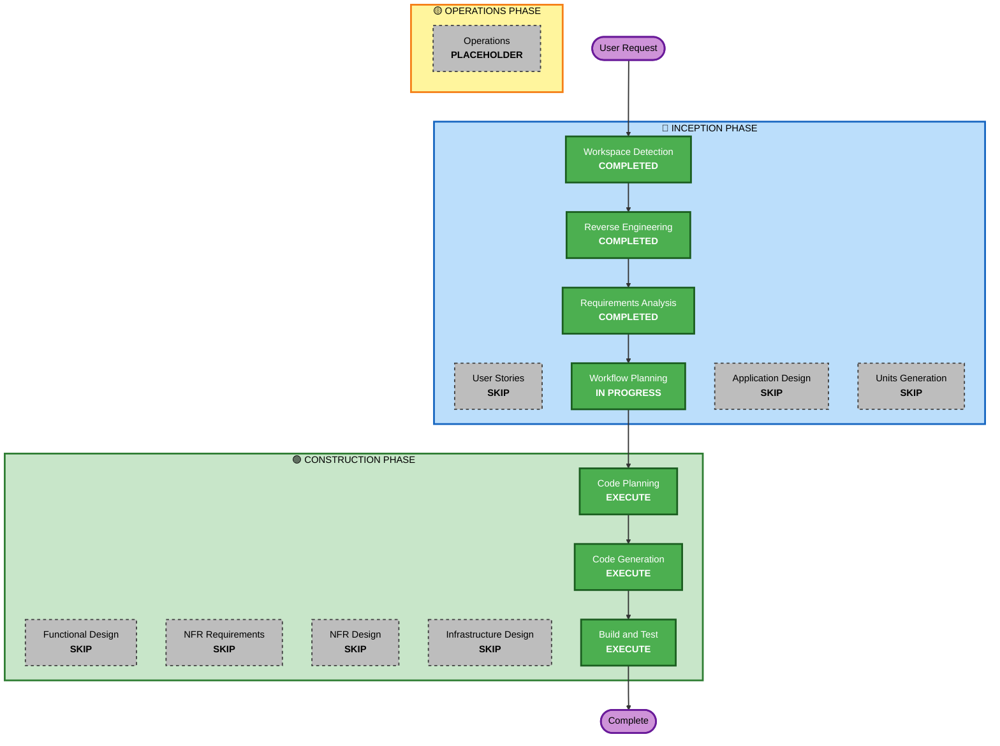

# Execution Plan

## Detailed Analysis Summary

### Change Impact Assessment
- **User-facing changes**: Yes - New Streak screen with pet animation, new bottom nav item
- **Structural changes**: Yes - New feature module, new repository, platform-specific Rive integration
- **Data model changes**: Yes - New StreakRepository with multi-day history storage
- **API changes**: No - All local, no server API changes
- **NFR impact**: Yes - Performance (Rive animation), platform-specific code (Android/iOS)

### Risk Assessment
- **Risk Level**: Medium
- **Rollback Complexity**: Easy (new feature, no existing code modified)
- **Testing Complexity**: Moderate (platform-specific Rive integration needs device testing)

## Workflow Visualization



### Text Alternative
```
INCEPTION PHASE:
  ✅ Workspace Detection (COMPLETED)
  ✅ Reverse Engineering (COMPLETED)
  ✅ Requirements Analysis (COMPLETED)
  ⬜ User Stories (SKIP)
  ✅ Workflow Planning (IN PROGRESS)
  ⬜ Application Design (SKIP)
  ⬜ Units Generation (SKIP)

CONSTRUCTION PHASE:
  ⬜ Functional Design (SKIP)
  ⬜ NFR Requirements (SKIP)
  ⬜ NFR Design (SKIP)
  ⬜ Infrastructure Design (SKIP)
  🟢 Code Planning (EXECUTE)
  🟢 Code Generation (EXECUTE)
  🟢 Build and Test (EXECUTE)

OPERATIONS PHASE:
  ⬜ Operations (PLACEHOLDER)
```

## Phases to Execute

### 🔵 INCEPTION PHASE
- [x] Workspace Detection (COMPLETED)
- [x] Reverse Engineering (COMPLETED)
- [x] Requirements Analysis (COMPLETED)
- [x] User Stories - SKIP
  - **Rationale**: Single user type, clear requirements, no complex personas needed
- [x] Workflow Planning (IN PROGRESS)
- [ ] Application Design - SKIP
  - **Rationale**: Feature fits within existing architecture (new feature module following established patterns). No new services or complex component dependencies needed.
- [ ] Units Generation - SKIP
  - **Rationale**: Single unit of work (Streak feature). No decomposition needed.

### 🟢 CONSTRUCTION PHASE
- [ ] Functional Design - SKIP
  - **Rationale**: Business logic is straightforward (streak = consecutive days with ≥1 pomodoro). No complex algorithms or domain models.
- [ ] NFR Requirements - SKIP
  - **Rationale**: NFRs are clear from requirements (platform-specific Rive, existing design system). No tech stack decisions needed.
- [ ] NFR Design - SKIP
  - **Rationale**: No NFR patterns needed beyond what's already in the project.
- [ ] Infrastructure Design - SKIP
  - **Rationale**: No infrastructure changes. All local storage (MultiplatformSettings).
- [ ] Code Planning - EXECUTE (ALWAYS)
  - **Rationale**: Need detailed plan for platform-specific Rive integration + shared streak logic
- [ ] Code Generation - EXECUTE (ALWAYS)
  - **Rationale**: Implementation of Streak feature across Android/iOS
- [ ] Build and Test - EXECUTE (ALWAYS)
  - **Rationale**: Build verification and test instructions needed

### 🟡 OPERATIONS PHASE
- [ ] Operations - PLACEHOLDER

## Estimated Timeline
- **Total Stages to Execute**: 3 (Code Planning + Code Generation + Build and Test)
- **Estimated Duration**: 2-3 interactions

## Success Criteria
- **Primary Goal**: Working Streak screen with Rive pet animation on Android + iOS
- **Key Deliverables**:
  - StreakRepository with multi-day history
  - Streak calculation logic (current + longest)
  - Calendar heat map composable
  - Rive pet integration (Android native + iOS expect/actual)
  - Bottom navigation integration
  - UI following AuraColors/GlassBox design system
- **Quality Gates**:
  - Compiles on both Android and iOS targets
  - Streak calculation correct
  - Rive animation loads and responds to inputs
