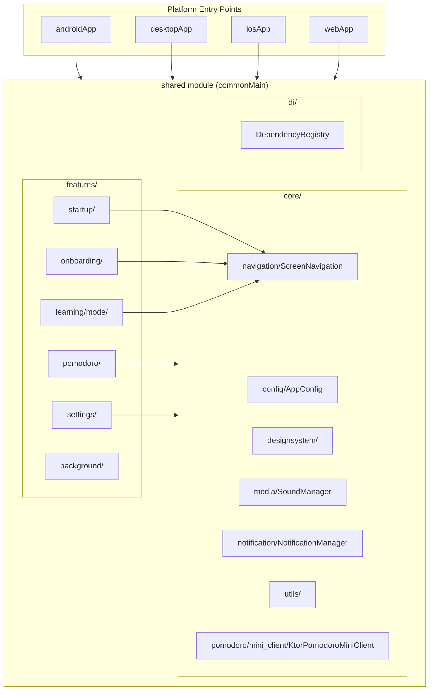
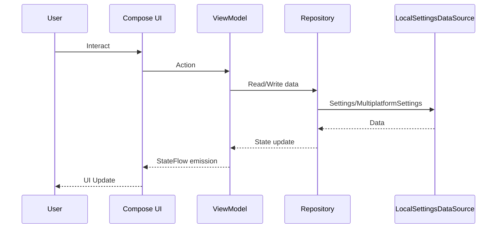

# System Architecture

## System Overview
Kotlin Multiplatform application sử dụng Compose Multiplatform cho UI, hỗ trợ Android, iOS, Desktop (JVM), và Web. Kiến trúc theo pattern MVVM với feature-based modular structure.

## Architecture Diagram

## Component Descriptions

### Platform Modules
| Module | Purpose | Type |
|--------|---------|------|
| androidApp | Android entry point (MainActivity) | Application |
| desktopApp | Desktop JVM entry point | Application |
| iosApp | iOS entry point (SwiftUI) | Application |
| webApp | Web entry point (Wasm/JS) | Application |
| shared | Shared business logic + UI | Library |

### Core Layer
| Component | Purpose |
|-----------|---------|
| AppConfig | Server URL, app configuration constants |
| DesignSystem | AuraColors, AuraTheme, GlassBox, AuraButton components |
| SoundManager | Platform-agnostic sound playback interface |
| ScreenNavigation | AuraScreen sealed interface + AuraNavigator |
| NotificationManager | Platform-agnostic notification interface |
| KtorPomodoroMiniClient | HTTP client for Pomodoro Mini server API |

### Feature Layer
| Feature | Purpose |
|---------|---------|
| startup | App loading, determine next destination |
| onboarding | First-time user setup flow |
| learning/mode | Learning style selection (Solo/Group) |
| pomodoro | Main workspace: timer, tasks, music, ambient |
| settings | User preferences management |
| background | Dynamic animated backgrounds |

## Data Flow

## Integration Points
- **Network API**: KtorPomodoroMiniClient → Pomodoro Mini Server (register, tasks, settings, stats)
- **Local Storage**: MultiplatformSettings (key-value) for user preferences and app state
- **Platform Services**: SoundManager, NotificationManager (platform-specific implementations)
