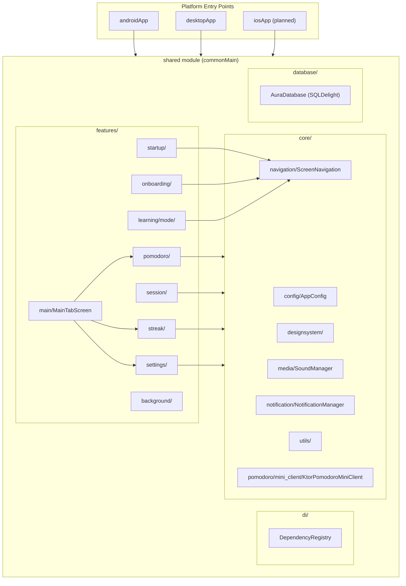
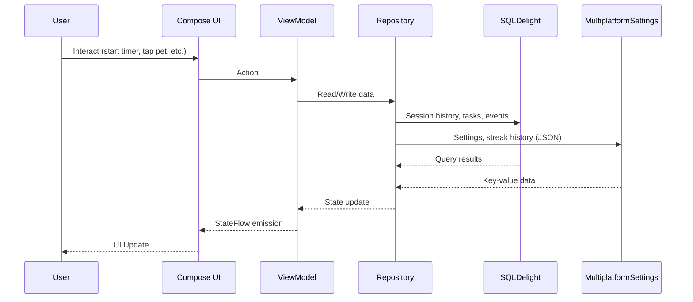

# System Architecture

## System Overview
Kotlin Multiplatform application sử dụng Compose Multiplatform cho UI, hỗ trợ Android, Desktop (JVM), iOS (planned). Kiến trúc theo pattern MVVM với feature-based modular structure. App sử dụng Voyager cho navigation, SQLDelight cho database persistence, và MultiplatformSettings cho local key-value storage.

## Architecture Diagram



### Text Alternative
```
Platform Entry Points: androidApp, desktopApp, iosApp → shared module
shared module:
  core/ → config, designsystem, media, navigation, notification, utils, pomodoro mini_client
  features/ → startup, onboarding, learning, pomodoro, session, streak, settings, background, main
  di/ → DependencyRegistry
  database/ → AuraDatabase (SQLDelight)
```

## Component Descriptions

### Platform Modules
| Module | Purpose | Type |
|--------|---------|------|
| androidApp | Android entry point (MainActivity + Compose) | Application |
| desktopApp | Desktop JVM entry point (main.kt) | Application |
| iosApp | iOS entry point (SwiftUI) - planned | Application |
| webApp | Web entry point (disabled in settings.gradle.kts) | Application |
| shared | Shared business logic + UI | Library |

### Core Layer
| Component | Purpose |
|-----------|---------|
| AppConfig | Server URL, app configuration constants (work/break minutes defaults) |
| DesignSystem | AuraColors, AuraTheme, AuraGradients, GlassBox, AuraButton, AuraDialog, BreathingEffect |
| SoundManager | Platform-agnostic sound playback interface (expect/actual) |
| ScreenNavigation | AuraScreen sealed interface + AuraNavigator |
| NotificationManager | Platform-agnostic notification interface (expect/actual) |
| KtorPomodoroMiniClient | HTTP client for Pomodoro Mini server API (register, login, settings, tasks, logs) |

### Feature Layer
| Feature | Purpose |
|---------|---------|
| startup | App loading, determine next destination based on onboarding state |
| onboarding | First-time user setup flow (OnboardingView) |
| learning/mode | Learning style selection (Solo/Group) + group configuration |
| pomodoro | Main workspace: timer, tasks, music, ambient (AppViewModel manages all) |
| session | Learning session lifecycle: create, persist (SQLDelight), history screen |
| streak | Streak calculation + calendar heat map + Rive pet animation |
| settings | User preferences management + background selection |
| background | Dynamic animated backgrounds |
| main | MainTabScreen: bottom navigation container (Timer/Streak/Settings tabs) |

## Data Flow


## Integration Points
- **Network API**: KtorPomodoroMiniClient → Pomodoro Mini Server (register, login, tasks, settings, pomodoro logs)
- **Local Database**: SQLDelight AuraDatabase → Session history, learning events, tasks
- **Local Storage**: MultiplatformSettings (key-value) → User settings, streak history (JSON), onboarding state
- **Platform Services**: SoundManager, NotificationManager (platform-specific expect/actual implementations)
- **Rive Animation**: Platform-specific Rive runtime (rive-android for Android, rive-ios planned for iOS)

## Navigation Flow
```
StartupLoadingScreen
  ├── (onboarding not completed) → OnboardingScreen → LearningStyleScreen → MainTabScreen
  └── (onboarding completed) → SessionHistoryScreen → LearningStyleScreen → MainTabScreen

MainTabScreen (Bottom Navigation)
  ├── Tab 0: PomodoroScreenUIv2 (Timer + Tasks + Ambient + Music)
  ├── Tab 1: StreakScreenContent (Pet + Streak Cards + Heat Map)
  └── Tab 2: Settings (placeholder)
```
