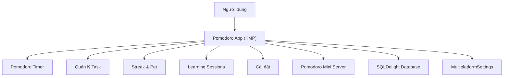

# Business Overview

## Business Context Diagram



### Text Alternative
```
User → Pomodoro App (KMP)
  → Pomodoro Timer
  → Task Management
  → Streak & Pet (Rive animation)
  → Learning Sessions
  → Settings
  → Pomodoro Mini Server (Remote API)
  → SQLDelight Database (Local)
  → MultiplatformSettings (Local KV)
```

## Business Description
- **Mục đích chính**: Ứng dụng quản lý thời gian theo phương pháp Pomodoro, kết hợp gamification (streak + pet animation) để tăng động lực
- **Đối tượng**: Sinh viên và người đi làm cần tập trung, quản lý thời gian hiệu quả
- **Mô hình**: Ứng dụng cá nhân + tính năng nhóm (group learning) + gamification (streak pet)
- **Nền tảng**: Android, Desktop (JVM), iOS (planned), Web (disabled)

## Business Transactions

| # | Transaction | Mô tả |
|---|-------------|--------|
| 1 | **Pomodoro Session** | Bắt đầu, tạm dừng, hoàn thành phiên Pomodoro (work/break/long break) |
| 2 | **Task Management** | Tạo, sửa, xóa, hoàn thành task gắn với phiên Pomodoro |
| 3 | **Learning Session Lifecycle** | Tạo mới session → configure → start → complete/pause → history |
| 4 | **Streak Tracking** | Tự động ghi nhận daily stats khi hoàn thành pomodoro, tính streak liên tiếp |
| 5 | **Pet Interaction** | Hiển thị Rive pet animation phản ứng theo streak/pomodoro state, tap interaction |
| 6 | **Settings Management** | Cấu hình work/break time, background, âm thanh |
| 7 | **Onboarding Flow** | Hướng dẫn người dùng mới qua các bước setup |
| 8 | **Learning Style Selection** | Chọn Solo/Group, configure group settings |
| 9 | **Background & Ambient** | Chọn dynamic background + ambient sounds khi làm việc |
| 10 | **Server Sync** | Register, login, sync settings/tasks với Pomodoro Mini Server |

## Business Dictionary

| Term | Meaning |
|------|---------|
| Pomodoro | Phiên làm việc tập trung (mặc định 25 phút) |
| Break | Thời gian nghỉ ngắn giữa các phiên (mặc định 5 phút) |
| Long Break | Thời gian nghỉ dài sau 4 phiên (mặc định 15 phút) |
| Task | Công việc cần hoàn thành trong phiên Pomodoro |
| Streak | Số ngày liên tiếp hoàn thành ít nhất 1 pomodoro |
| DailyRecord | Bản ghi số pomodoro hoàn thành trong 1 ngày |
| LearningSession | Một phiên học tập có thời gian bắt đầu/kết thúc, chứa nhiều pomodoro rounds |
| LearningStyle | Phong cách học: Solo hoặc Group |
| Pet (Rive) | Mèo animation Rive phản ứng theo streak level và pomodoro state |
| Heat Map | Calendar grid hiển thị intensity hoạt động theo ngày |
| Workspace | Màn hình chính chứa timer, tasks, ambient |
| Compact Mode | Chế độ thu gọn UI |
| MainTabScreen | Bottom navigation với 3 tabs: Timer, Streak, Settings |

## Component Level Business Descriptions

### Pomodoro Timer (features/pomodoro)
- **Purpose**: Đếm ngược thời gian phiên Pomodoro, chuyển đổi giữa work/break/long break
- **Responsibilities**: Start/pause/reset timer, chuyển mode tự động, thông báo khi hết giờ, increment streak khi hoàn thành

### Task Management (features/pomodoro/task)
- **Purpose**: Quản lý danh sách công việc gắn với session
- **Responsibilities**: CRUD tasks, đánh dấu hoàn thành, tracking focus time per task

### Streak & Pet (features/streak)
- **Purpose**: Gamification - tracking streak + pet animation
- **Responsibilities**: Tính toán streak (current/longest), calendar heat map, hiển thị Rive pet animation (Android/iOS), tap interaction

### Learning Sessions (features/session)
- **Purpose**: Quản lý lifecycle các phiên học tập
- **Responsibilities**: Tạo/lưu/xem lịch sử sessions, tính total focus time, quản lý events

### Settings (features/settings)
- **Purpose**: Cấu hình cá nhân hóa
- **Responsibilities**: Work/break time, background selection, onboarding state

### Startup & Onboarding (features/startup, features/onboarding)
- **Purpose**: Khởi động app và hướng dẫn người dùng mới
- **Responsibilities**: Route to correct screen based on onboarding state

### Background & Ambient (features/background, pomodoro/ambient, pomodoro/music)
- **Purpose**: Tạo không gian làm việc thoải mái
- **Responsibilities**: Dynamic animated backgrounds, ambient sounds, music playback
