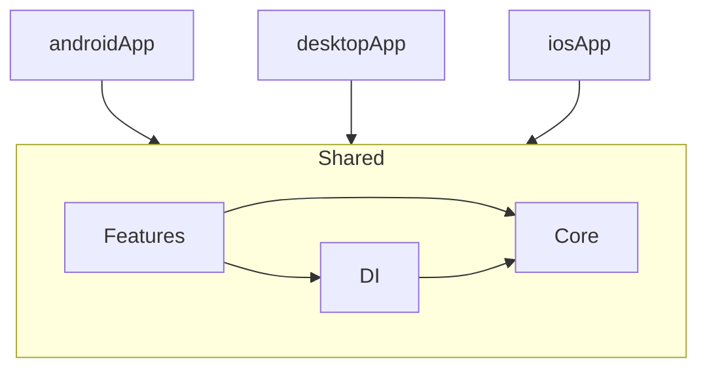

# Dependencies

## Internal Dependencies

### Module Dependencies
| Module | Depends On |
|--------|-----------|
| androidApp | shared |
| desktopApp | shared |
| iosApp | shared (via framework) |

### Feature to Core Dependencies
| Feature | Core Dependencies |
|---------|------------------|
| startup | navigation, config |
| onboarding | designsystem |
| learning | designsystem, navigation |
| pomodoro | designsystem, media, notification, utils, mini_client |
| session | designsystem, utils |
| streak | designsystem |
| settings | designsystem |
| background | designsystem |

## External Dependencies

### Runtime
| Dependency | Version | Purpose |
|-----------|---------|---------|
| compose-runtime | 1.11.0 | Compose runtime |
| compose-foundation | 1.11.0 | Compose foundation |
| compose-material3 | 1.11.0-alpha07 | Material Design 3 |
| voyager-navigator | 2.2.21 | Screen navigation |
| voyager-transitions | 2.2.21 | Navigation transitions |
| voyager-screenmodel | 2.2.21 | Screen-scoped models |
| voyager-lifecycle-kmp | 2.2.21 | Lifecycle support |
| ktor-client-core | 3.0.1 | HTTP client |
| ktor-client-cio | 3.0.1 | CIO engine (Android/JVM) |
| ktor-client-content-negotiation | 3.0.1 | Content type handling |
| ktor-serialization-kotlinx-json | 3.0.1 | JSON serialization |
| multiplatform-settings | 1.3.0 | Key-value storage |
| kotlinx-serialization-json | 1.8.0 | JSON codec |
| kotlinx-datetime | 0.7.1 | Date/time |
| lifecycle-viewmodel-compose | 2.11.0-beta01 | ViewModel |
| lifecycle-runtime-compose | 2.11.0-beta01 | Lifecycle runtime |
| sqldelight-runtime | 2.3.2 | SQLDelight runtime |
| sqldelight-coroutines | 2.3.2 | SQLDelight Flow extensions |
| sqldelight-android-driver | 2.3.2 | Android SQLite driver |
| sqldelight-sqlite-driver | 2.3.2 | JVM SQLite driver |
| rive-android | 11.7.1 | Rive animation (Android) |
| androidx-startup-runtime | 1.1.1 | Rive initialization |
| jlayer | 1.0.1 | MP3 playback (JVM only) |

### Test
| Dependency | Version | Purpose |
|-----------|---------|---------|
| kotlin-test | 2.3.21 | Assertions + test runner |
| kotlinx-coroutines-test | 1.11.0 | TestScope, TestDispatcher |
