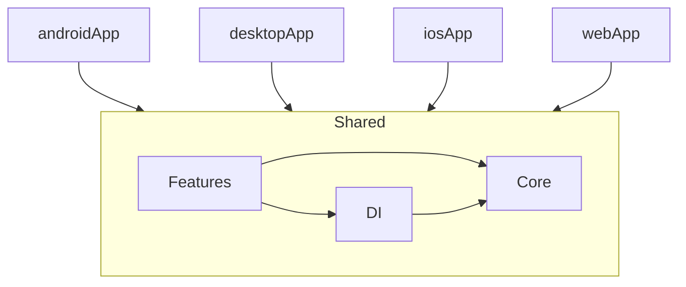

# Dependencies

## Internal Dependencies

### Module Dependencies
| Module | Depends On |
|--------|-----------|
| androidApp | shared |
| desktopApp | shared |
| iosApp | shared (via framework) |
| webApp | shared (disabled) |

### Feature → Core Dependencies
| Feature | Core Dependencies |
|---------|------------------|
| startup | navigation, config |
| onboarding | designsystem |
| learning | designsystem, navigation |
| pomodoro | designsystem, media, notification, utils, mini_client |
| settings | designsystem |
| background | designsystem |

## External Dependencies

### Runtime
| Dependency | Version | Purpose | License |
|-----------|---------|---------|---------|
| compose-runtime | 1.11.0 | Compose runtime | Apache 2.0 |
| compose-foundation | 1.11.0 | Compose foundation | Apache 2.0 |
| compose-material3 | 1.11.0-alpha07 | Material Design 3 | Apache 2.0 |
| voyager-navigator | 2.2.21 | Screen navigation | MIT |
| voyager-transitions | 2.2.21 | Navigation transitions | MIT |
| voyager-screenmodel | 2.2.21 | Screen-scoped models | MIT |
| voyager-lifecycle-kmp | 2.2.21 | Lifecycle support | MIT |
| ktor-client-core | 3.0.1 | HTTP client | Apache 2.0 |
| ktor-client-cio | 3.0.1 | CIO engine (Android/JVM) | Apache 2.0 |
| ktor-client-content-negotiation | 3.0.1 | Content type handling | Apache 2.0 |
| ktor-serialization-kotlinx-json | 3.0.1 | JSON serialization | Apache 2.0 |
| multiplatform-settings | 1.3.0 | Key-value storage | Apache 2.0 |
| kotlinx-serialization-json | 1.8.0 | JSON codec | Apache 2.0 |
| lifecycle-viewmodel-compose | 2.11.0-beta01 | ViewModel | Apache 2.0 |
| lifecycle-runtime-compose | 2.11.0-beta01 | Lifecycle runtime | Apache 2.0 |
| jlayer | 1.0.1 | MP3 playback (JVM only) | LGPL |

### Test
| Dependency | Version | Purpose |
|-----------|---------|---------|
| kotlin-test | 2.3.21 | Assertions + test runner |
| kotlinx-coroutines-test | 1.11.0 | TestScope, TestDispatcher |

### Inactive (commented out)
| Dependency | Version | Purpose |
|-----------|---------|---------|
| sqldelight-android | 2.1.0 | SQLite driver Android |
| sqldelight-native | 2.1.0 | SQLite driver iOS |
| sqldelight-sqlite | 2.1.0 | SQLite driver JVM |
| sqldelight-coroutines | 2.1.0 | Flow extensions |
